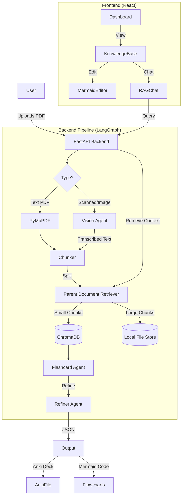

# FlashDeck AI ⚡

> **Transform your chaotic notes and lecture slides into structured, interactive study materials.**

**FlashDeck AI** is a state-of-the-art study platform built for the **Native AI Workshop**. It leverages advanced Agentic Workflows, Multi-modal RAG (Retrieval-Augmented Generation), and generative AI to instantly convert complex PDF documents (text, scanned images, handwritten notes) into:
1.  **Anki-Ready Flashcards**: Spaced repetition compatible.
2.  **Visual Knowledge Graphs**: Interactive, editable flowcharts.
3.  **AI Tutor**: A context-aware chatbot that cites its sources.

 *(Placeholder)*

---

## 🌟 Key Features

### 🧠 Advanced RAG Engine (v4)
*   **Parent Document Retriever**: Uses a sophisticated indexing strategy (Child Chunks for search, Parent Chunks for context) to ensure the AI "reads" full pages rather than fragmented sentences.
*   **Multi-Modal**: Integrates a Vision Agent to OCR and transcribe text from images and scanned PDFs before processing.

### 🎨 Visual Learning
*   **Flowchart Generation**: Automatically extracts processes and hierarchies from your text and renders them as Mermaid.js diagrams.
*   **Live Editor**: Tweak and customize your flowcharts directly in the Knowledge Base with a live preview.
*   **Export**: Download your diagrams as high-quality PNG or JPEG images.

### 📚 Study Tools
*   **Notebook interface**: A clean, 3-pane dashboard inspired by NotebookLM.
*   **Topic Clustering**: Flashcards are automatically grouped by key topics.
*   **Anki Export**: One-click download of `.apkg` files.

---

## 🏗️ System Architecture

The system uses a **FastAPI** backend orchestrating **LangGraph** agents, connected to a **React** frontend.



### Tech Stack

| Component | Technology | Role |
| :--- | :--- | :--- |
| **Backend** | Python 3.9+, FastAPI | REST API & Orchestration |
| **AI Agents** | LangChain, LangGraph | Agentic Workflow Design |
| **Vector DB** | ChromaDB | Semantic Search (Child Documents) |
| **Storage** | LocalFileStore (Pickle) | Component Storage (Parent Documents) |
| **LLM** | Google Gemini 3 Flash | Via OpenRouter (Fast Reasoning) |
| **Frontend** | React, Vite | Reactive UI |
| **Styling** | Tailwind CSS, Lucide | Modern, Dark-Mode Design |
| **Diagrams** | Mermaid.js | Code-to-Diagram Rendering |

---

## 🚀 Installation & Setup

### Prerequisites
*   **Node.js** (v18 or higher)
*   **Python** (v3.10 or higher)
*   **OpenRouter API Key** (with access to Gemini or GPT-4o models)

### 1. Backend Setup

The backend handles all AI logic.

```bash
# 1. Navigate to backend
cd backend

# 2. Create Virtual Environment
python -m venv venv

# 3. Activate Virtual Environment
# Windows:
.\venv\Scripts\activate
# Mac/Linux:
# source venv/bin/activate

# 4. Install Dependencies
pip install -r requirements.txt

# 5. Configure Environment
# Create a .env file and add your key:
echo "OPENROUTER_API_KEY=sk-or-your-key-here" > .env

# 6. Run Server
uvicorn main:app --port 8001 --reload
```
*Server will start at `http://127.0.0.1:8001`*

### 2. Frontend Setup

The frontend provides the user interface.

```bash
# 1. Navigate to frontend
cd frontend

# 2. Install Packages
npm install

# 3. Start Dev Server
npm run dev
```
*Visit `http://localhost:5173` to launch the app.*

---

## 📖 Usage Guide

1.  **Home Screen**: Click **"Get Started"** to enter the app.
2.  **Dashboard**: Drag & Drop your PDF files (select "Vision Mode" if they are scanned images).
3.  **Generation**: Wait for the AI Agents to analyze, chunk, and generate content.
4.  **My Decks**:
    *   **Study**: Download the `.apkg` for Anki.
    *   **Explore**: Click **"Enter Knowledge Base"** to view the graph and chat.
5.  **Knowledge Base**:
    *   **Left Pane**: View source files.
    *   **Center Pane**: Interact with your Flowchart. Click the **Edit (Pencil)** icon to modify the diagram code. Click **Save** to apply changes. Download as PNG/JPG.
    *   **Right Pane**: Chat with your documents. The AI uses the Advanced RAG engine to retrieve full-page context for precise answers.

---

## 📂 Project Structure

```
flashdeck-ai/
├── backend/
│   ├── main.py              # FastAPI Entry Point
│   ├── agent_graph.py       # LangGraph Workflow Definition
│   ├── rag_engine.py        # RAG Logic (ParentDocumentRetriever)
│   ├── deck_builder.py      # GenAnki Logic
│   └── vision_engine.py     # OCR Logic
├── frontend/
│   ├── src/
│   │   ├── pages/
│   │   │   ├── Dashboard.jsx
│   │   │   ├── KnowledgeBase.jsx
│   │   │   └── ...
│   │   ├── components/
│   │   │   ├── MermaidEditor.jsx
│   │   │   └── ...
└── ...
```

---

## 🤝 Contribution Needs

We are currently looking for help with:
- [ ] **Mobile Responsiveness**: Optimizing the Knowledge Base for smaller screens.
- [ ] **Voice Mode**: Adding Text-to-Speech for the Chatbot.

---

*Verified for Native AI Workshop • v4.0*
