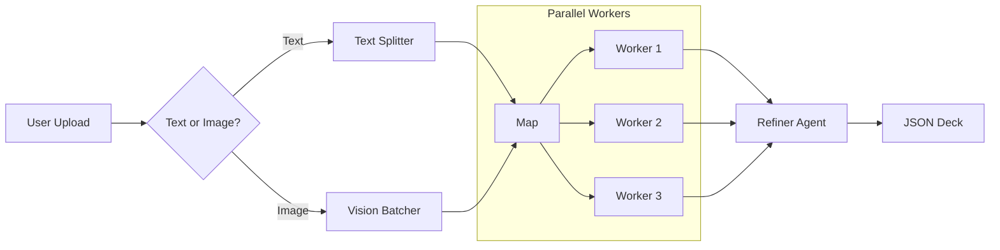

# ⚡ FlashDeck AI (v2.0 Turbo)

> **"The Ultimate AI Flashcard Generator. Now with Vision & Parallel Processing."**

FlashDeck AI is a sophisticated multi-agent platform that turns **Any Document** (PDFs, Scanned Notes, Slides) into high-quality Anki flashcards. It mimics the power of **Google NotebookLM** but is specialized for active recall.

---

## 🚀 New in v2.0: "Turbo Mode"
-   **👁️ Vision Engine**: Automatically detects scanned PDFs or handwriting and uses **Gemini Vision** to "read" the pages.
-   **⚡ Map-Reduce Architecture**: Processes documents in **Parallel Batches** (Map-Reduce pattern) using LangGraph.
-   **🏎️ Speed**: 5x faster generation using **Gemini 3 Flash** and Batching (5 slides per prompt).

---

## 🏗️ Architecture



## 🛠️ Tech Stack
-   **Backend**: FastAPI, LangGraph (Map-Reduce), Pydantic
-   **AI**: Google Gemini 3 Flash (via OpenRouter)
-   **Frontend**: React, Vite, TailwindCSS (Notion Style)
-   **Monitoring**: LangSmith Tracing

---

## ⚡ Quick Start

### 1. Backend
```bash
cd backend
# Setup Env
cp ../.env.example ../.env
# (Add your OPENROUTER_API_KEY)

# Install
pip install -r requirements.txt

# Run
uvicorn main:app --reload --port 8001
```

### 2. Frontend
```bash
cd frontend
npm install
npm run dev
```
