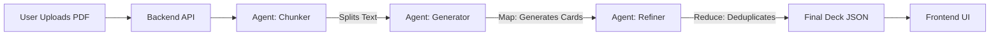

# ⚡ FlashDeck AI (Native AI Workshop)

> **"From PDF to Flashcards in Seconds — Powered by Multi-Agent AI."**

FlashDeck AI is a full-stack automated flashcard generation platform. It mimics the efficiency of **Google's NotebookLM**, analyzing complex PDF documents (100+ slides) and intelligently synthesizing them into high-quality Anki flashcards using a **LangGraph Multi-Agent Architecture**.

---

## 🏗️ Architecture: The Agentic Workflow

We moved beyond simple RAG. FlashDeck uses a **Map-Reduce Agent Graph** to process documents at scale without losing context.



### 🧠 The Agents (LangGraph)
1.  **The Chunker**: Splits large PDFs into logical semantic blocks (avoiding token limits).
2.  **The Generator**: A parallelized agent that reads each chunk and extracts key concepts into Q&A pairs (using `Gemini-3-Pro-Preview`).
3.  **The Refiner**: Aggregates all generated cards, removes duplicates, and ensures quality consistency.

---

## 🚀 Key Features
-   **Multi-Agent Backend**: Powered by **LangChain**, **LangGraph**, and **OpenRouter** (Gemini Models).
-   **Observability**: Full tracing and monitoring via **LangSmith**.
-   **Notion-Style UI**: A premium, dark-mode aesthetic built with **React**, **Vite**, and **TailwindCSS**.
-   **Interactive Study**: Hover-to-reveal answers (optional), Focus Mode, and Grid View.
-   **Universal Export**: 
    -   📸 **Image Grid** (PNG) for sharing.
    -   📄 **PDF** (High-Res 300DPI) for printing.
    -   🎴 **Anki Package** (.apkg) for serious study.

---

## 🛠️ Tech Stack

### Phase 1: Backend (Python)
-   **Framework**: FastAPI
-   **AI Orchestration**: LangChain, LangGraph
-   **Model**: Google Gemini 3 Pro Preview (via OpenRouter)
-   **Tracing**: LangSmith
-   **PDF Processing**: PyPDF

### Phase 2: Frontend (React)
-   **Framework**: Vite + React
-   **Styling**: Tailwind CSS (Dark Mode)
-   **Icons**: Lucide React
-   **Components**: Custom Sticky Tabs, Glassmorphism Cards

---

## ⚡ Quick Start

### 1. Backend Setup
```bash
cd backend
pip install -r requirements.txt

# Environment Setup
# Copy the example env file to .env
cp ../.env.example ../.env

# Edit the .env file with your specific keys:
# - LANGSMITH_API_KEY
# - OPENROUTER_API_KEY
```

```bash
# Run Server
uvicorn main:app --reload --port 8001
```

### 2. Frontend Setup
```bash
cd frontend
npm install
npm run dev
```

Visit `http://localhost:5173` and drag-and-drop your lecture notes! 🎓
