# ⚡ FlashDeck AI (Native)


> **"Turn Chaos into Knowledge. Instantly."**
> A production-grade **Agentic AI** platform that transforms massive PDFs, handwritten notes, and slide decks into high-quality Anki flashcards using a parallel **Map-Reduce** architecture.

---

## 🧠 The Agentic Architecture

FlashDeck moves beyond simple RAG or linear chains. It employs a sophisticated **Map-Reduce Graph** powered by **LangGraph** to process documents in parallel, ensuring speed without sacrificing depth.

```mermaid
graph TD
    User([User Upload 📄]) -->|PDF Stream| API[FastAPI Entrypoint]
    
    subgraph "Phase 1: Ingestion & Analysis"
        API --> Vision{Is Scanned?}
        Vision -->|Yes| VE[Agent: Vision Engine]
        Vision -->|No| TE[Agent: Text Extractor]
        
        VE -->|List of Images| Batcher[Node: Batcher]
        TE -->|Raw Text| Chunker[Node: Chunker]
    end
    
    subgraph "Phase 2: Map (Parallel Execution)"
        Batcher -->|Distribute Batches| Map((Map Jobs))
        Chunker -->|Distribute Chunks| Map
        
        Map --> Worker1[🤖 Generator Worker 1]
        Map --> Worker2[🤖 Generator Worker 2]
        Map --> Worker3[🤖 Generator Worker 3]
        Map --> WorkerN[🤖 Generator Worker N]
    end
    
    subgraph "Phase 3: Reduce (Refinement)"
        Worker1 & Worker2 & Worker3 & WorkerN -->|Partial Decks| Refiner[🎩 Agent: Refiner]
        Refiner -->|Deduplicate & Polish| FinalDeck[Final JSON Deck]
    end
    
    FinalDeck --> Frontend[React UI 🃏]
```



---

## 🤖 Meet the Agents

The system is orchestrated by a team of specialized AI agents working in concert:

| Agent | Role | Capability |
| :--- | :--- | :--- |
| **👁️ The Visionary** | `vision_engine` | Uses **PyMuPDF** to render PDF pages as high-res images. Detects scanned documents and "reads" handwritten notes. |
| **📦 The Logistics Manager** | `chunker/batcher` | Intelligently groups content into efficient "Jobs". Batches 5+ images per job to maximize throughput and minimize costs. |
| **🎓 The Professor** | `generator_node` | A parallelized worker using **Gemini 3 Flash**. Reads a batch of content and extracts "Deep Knowledge" Q&A pairs. |
| **🧐 The Editor** | `refiner_node` | The Reducer. usage specialized algorithms to aggregate thousands of generated cards, remove duplicates, and normalize formatting. |

---

## 🛠️ Technology Stack

We use a "Native AI" stack designed for performance and observability.

### Backend (Python)
-   **Orchestration**: `LangChain` + `LangGraph` (State Management & Graph)
-   **API Framework**: `FastAPI` (Async Web Server)
-   **Model**: `Google Gemini 3 Flash` (via OpenRouter)
-   **Processing**: `PyMuPDF` (Vision), `Pydantic` (Validation)
-   **Observability**: `LangSmith` (Full Traceability of every agent step)

### Frontend (React)
-   **Framework**: `Vite` + `React`
-   **Styling**: `TailwindCSS` (Notion-inspired Dark Mode)
-   **State**: `React Hooks` for real-time progress updates.

---

## 🚀 Features at a Glance

-   **📸 Vision-First**: First-class support for handwritten notes and scanned books.
-   **⚡ Turbo Speed**: Benchmarked at **150+ pages per minute** using async parallelization.
-   **🤑 Cost Efficient**: Smart Batching reduces token usage by **80%**.
-   **🎨 Premium UI**: A distraction-free, "Sticky-Tab" interface aimed at deep work.
-   **📤 Universal Export**: One-click export to **Anki** (.apkg), **PDF** (Print), or Image Grids.

---

## ⚡ Quick Start Guide

### 1. Backend Setup
```bash
cd backend
# 1. Install Dependencies
pip install -r requirements.txt

# 2. Configure Environment
# Copy example and add your OpenRouter Key
cp ../.env.example ../.env 

# 3. Ignite the Engine
uvicorn main:app --reload --port 8001
```

### 2. Frontend Setup
```bash
cd frontend
# 1. Install Node Modules
npm install

# 2. Launch Interface
npm run dev
```

---

*Built with ❤️ for the Native AI Workshop.*
