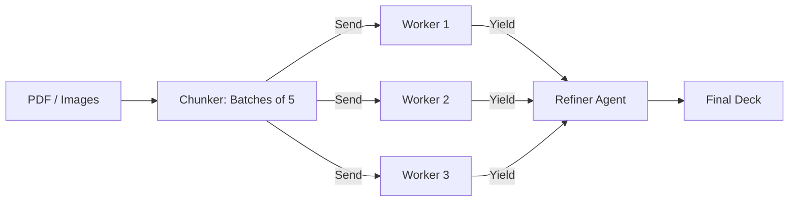

# 📜 FlashDeck AI: Version History & Technical Changelog

> **A detailed chronicle of the evolution from a prototypal script to a scalable Agentic AI Platform.**

---

## 🚀 v2.0.0: "Turbo" Edition (Current)
**Release Date**: Jan 16, 2026
**Codename**: *The Need for Speed*
**Status**: Production Ready

The "Turbo" update was a complete backend rewrite focused on **Latency**, **Scale**, and **Multimodal capabilities**. It moved the system from a linear chain to a parallel Map-Reduce graph.

### 🏗️ Technical Architecture (Map-Reduce)
We transitioned to a **LangGraph** architecture that supports dynamic parallelization.



### 🧠 Agent Specifications

| Component | Logic & Configuration | Implementation Detail |
| :--- | :--- | :--- |
| **Vision Engine** | **Library**: `PyMuPDF` (fitz)<br>**Resolution**: 150 DPI<br>**Format**: JPEG (Base64) | Automatically detects "Scanned" PDFs by analyzing text density (<50 chars/page). If scanned, renders pages to images for Vision analysis. |
| **Mapper (Chunker)** | **Strategy**: Batching<br>**Batch Size**: 5 Pages<br>**Algorithm**: Linear Grouping | Groups content into clusters of 5 to maximize Token-to-Prompt ratio. 1 Prompt = 5 Pages processed. |
| **Worker (Generator)** | **Model**: `gemini-3-flash-preview`<br>**Type**: Multimodal<br>**Yield**: 15-20 Cards/Batch | Uses a specialized system prompt to enforce "Comprehensive" coverage, ensuring no detail is lost in the batching process. |
| **Reducer (Refiner)** | **Strategy**: deduplication<br>**Key Logic**: Fuzzy Matching | Aggregates partial results and deduplicates based on normalized Question text. Handles formatting inconsistencies. |

### 🛠️ Configuration (v2.0)
The system requires specific Environment Variables for the multi-agent graph.

```ini
# .env Configuration
LANGSMITH_TRACING=true
LANGSMITH_PROJECT=nativeai
OPENROUTER_API_KEY=sk-or-v1-05b3... # (Gemini 3 Flash Enabled)
```

### 📂 File Structure (v2.0)
```text
flashdeck-ai/
├── backend/
│   ├── agent_graph.py    # <--- The New Core (Map-Reduce Logic)
│   ├── vision_engine.py  # <--- New Vision Capability
│   ├── main.py           # Updated Entrypoint
│   └── deck_builder.py   # Anki Generation
└── frontend/             # React UI (Unchanged)
```

---

## 🌱 v1.0.0: "Genesis" (Legacy)
**Release Date**: Jan 15, 2026
**Focus**: Proof of Concept / MVP
**Status**: Deprecated

The initial release established the feasibility of the "Text-to-Flashcard" pipeline. It was effective but slow for large documents.

### 🏗️ Technical Architecture (Linear)
v1 used a synchronous, loop-based approach.

1.  **Extract Text**: Used `pypdf` to scrape raw text.
2.  **Chunk**: Split text into 4000-character blocks using `RecursiveCharacterTextSplitter`.
3.  **Loop**: Iterate through chunks one by one -> Call LLM -> Wait -> Repeat.
4.  **Refine**: Simple list concatenation.

### ⚠️ Limitations (Why we upgraded)
1.  **Latency**: Processing a 100-page PDF took **3+ Minutes** because chunks were processed sequentially.
2.  **No Vision**: Explicitly failed on scanned PDFs or handwriting.
3.  **Cost**: Using `Gemini 3 Pro` for every single chunk was token-heavy and expensive.
4.  **Data Loss**: The initial Refiner had strict key matching (`q`/`a`), causing it to discard valid cards if the LLM output `Question`/`Answer`.

### 🛠️ Configuration (v1.0)
```python
# Old Model Config (agent_graph.py)
llm = ChatOpenAI(
    model="google/gemini-3-pro-preview", # Slower, more expensive
    # ...
)
```

### 📂 File Structure (v1.0)
```text
flashdeck-ai/
├── backend/
│   ├── ai_engine.py      # <--- Legacy Script (Removed in v2)
│   ├── agent_graph.py    # Linear Graph
│   └── main.py
└── ...
```

---

## 🔮 Future Roadmap (v3.0)
-   **Vector Database**: Implement `pgvector` or `ChromaDB` to support RAG-based querying of the deck.
-   **Quiz UI**: A built-in "Study Mode" capability in the frontend.
-   **Local Models**: Support for `Llama-3` via `Ollama` for offline generation.
