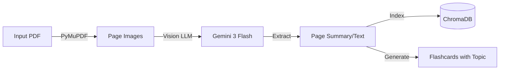
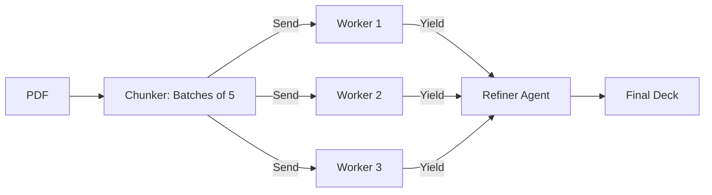

# 📜 FlashDeck AI: Version History & Technical Changelog

> **A detailed chronicle of the evolution from a prototypal script to a scalable Agentic AI Platform.**

## 🛠️ Current Tech Stack (v3.1)
| Component | Technology | Role |
| :--- | :--- | :--- |
| **Frontend** | React + Vite + Tailwind | Responsive UI & State Management |
| **Backend** | FastAPI + Uvicorn | High-performance Async API |
| **Orchestration** | **LangGraph** | Cyclic State Machine for Agent workflows |
| **AI Model** | **Google Gemini 3 Flash** | Low-latency Vision & Text Inference (via OpenRouter) |
| **Vector DB** | ChromaDB | Local embedding storage for RAG |
| **Observation** | LangSmith (Optional) | Tracing & Debugging |

---

## 🟢 v3.1: "The Polish" Update (Current)
**Release Date**: Jan 17, 2026
**Branch**: `main`, `version-3`
**Status**: Production Ready

Building on the v3.0 overhaul, this update focused on **User Experience (UX)** and **System Hygiene**. We restored critical features lost during the rewrite and cleaned up technical debt.

### ✨ Key Features
*   **Export Functionality**: Restored ability to download flashcards as PDFs.
    *   *Implementation*: Uses `html2canvas` to capture the DOM element of the card grid and `jspdf` to generate a paginated PDF document.
*   **Navigation & Routing**:
    *   Added explicit `Home` (🏠) buttons to `Dashboard`, `MyDecks`, and `KnowledgeBase`.
    *   Refactored `App.jsx` to maintain state (deck data) across route transitions.

### 🧹 Codebase & Tech
*   **Cleanup**: Deleted legacy components (`ChatSidebar.jsx`, `StickyTabs.jsx`) to reduce bundle size.
*   **Prompt Engineering**: Fixed a critical LangChain bug where JSON schema descriptions containing `{}` were being parsed as missing F-String variables.

---

## 🟡 v3.0: "Vision RAG" Overhaul
**Release Date**: Jan 16, 2026
**Focus**: Scanned Docs & Advanced UI
**Model Change**: Switched from **Gemini 3 Pro** -> **Gemini 3 Flash** (Speed & Vision focus).

This version solved the "Scanned PDF" problem. Previous versions failed to read text from images. v3.0 introduced a vision-based transcription step and a completely new UI.

### 🧠 AI Architecture (Vision Pipeline)
We moved to a "Transcribe-First" RAG approach for image-heavy documents.



### 🎨 UI Architecture (The 3-Pane Layout)
We abandoned the "Sidebar" navigation for a "Workspace" model.

| Feature | Description |
| :--- | :--- |
| **Knowledge Base** | A dedicated 3-pane IDE for study: **(1) Source Files**, **(2) Zoomable Flowchart**, **(3) AI Chat**. |
| **Topic Grid** | Flashcards are now grouped by Semantic Topic (e.g., "Intro", "Deep Learning") rather than a flat list. |

### 📂 File Structure (v3.0)
```text
flashdeck-ai/
├── backend/
│   ├── rag_engine.py     # <--- NEW: Dedicated RAG handling
│   ├── agent_graph.py    # Updated with Transcription Node
│   └── chroma_db/        # Local Vector Store
└── frontend/
    └── src/pages/
        ├── MyDecks.jsx       # Topic Grid
        └── KnowledgeBase.jsx # 3-Pane Studio
```

---

## 🟠 v2.0: "Turbo" / "Agentic" Shift
**Release Date**: Jan 16, 2026
**Focus**: Latency, Scale, Parallelism
**Model**: **Gemini 3 Pro Preview** (Chosen for reasoning depth)

The "Turbo" update was a complete backend rewrite. It moved the system from a linear chain to a parallel **Map-Reduce** graph using LangGraph.

### 🏗️ Technical Architecture (Map-Reduce)
We transitioned to a **LangGraph** architecture that supports dynamic parallelization.



### 🧠 Agent Specifications

| Component | Implementation Detail |
| :--- | :--- |
| **Mapper (Chunker)** | Groups content into clusters of 5 pages to maximize Token-to-Prompt ratio. |
| **Worker (Generator)** | Uses `gemini-3-pro` to generate high-quality Q&A pairs from batches. |
| **Reducer (Refiner)** | Aggregates partial results and deduplicates based on fuzzy matching of Questions. |

### 🛠️ Configuration (v2.0)
```ini
# .env Configuration (v2)
LANGSMITH_TRACING=true
OPENROUTER_API_KEY=sk-or-v1... # Gemini 3 Pro
```

---

## 🔴 v1.0: "Genesis" (Legacy)
**Release Date**: Jan 15, 2026
**Focus**: Proof of Concept / MVP
**Model**: **Gemini 3 Pro Preview**

The initial release established the feasibility of the "Text-to-Flashcard" pipeline. It was effective but slow for large documents as it processed chunks sequentially.

### 🏗️ Technical Architecture (Linear)
v1 used a synchronous, loop-based approach.

1.  **Extract Text**: Used `pypdf` to scrape raw text.
2.  **Chunk**: Split text into 4000-character blocks using `RecursiveCharacterTextSplitter`.
3.  **Loop**: Iterate through chunks one by one -> Call LLM -> Wait -> Repeat.
4.  **Refine**: Simple list concatenation.

### ⚠️ Limitations (Why we upgraded)
1.  **Latency**: Processing a 100-page PDF took **3+ Minutes**.
2.  **No Vision**: Explicitly failed on scanned PDFs or handwriting.
3.  **Cost**: Using `Gemini 3 Pro` for every single chunk sequentially was inefficient.
